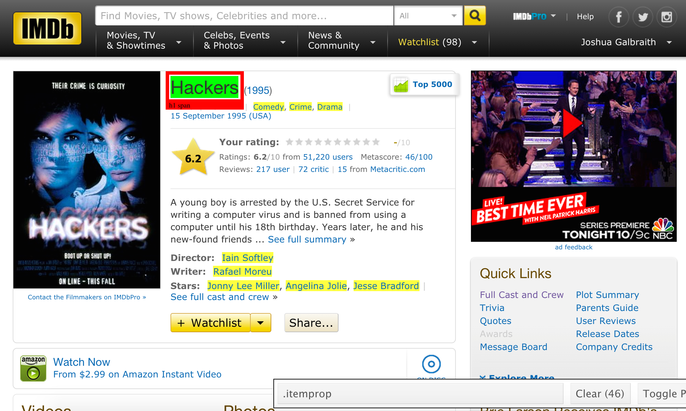

--- 
title       : Scraping the Web with rvest
subtitle    : A survey of Hadley Wickham's rvest package
author      : Joshua Galbraith
job         : Chief Data Scientist at Network Redux
framework   : io2012
highlighter : highlight.js
hitheme     : tomorrow_night
mode        : selfcontained
knit        : slidify::knit2slides
---

## Harvesting data from web pages

### Python
* [Beautiful Soup](http://www.crummy.com/software/BeautifulSoup/)
* [RoboBrowser](http://robobrowser.readthedocs.org/en/latest/readme.html)

### Ruby
* [Nokogiri](http://www.nokogiri.org)

### R
```{r}
library("magrittr")
library("rvest")
```

---

## SelectorGadget

[SelectorGadget](http://selectorgadget.com) is an open source browser tool to interactively generate minimal CSS selectors.

<div style='text-align: center;'>

</div>

---

## Navigation

* `html_session()`
```{r}
s <- html_session("http://www.imdb.com/title/tt0113243/")
is.session(s)
```

* `follow_link()` and `jump_to()`
```{r}
s %<>% follow_link("Full Cast and Crew")
```

---

## Navigation

* `back()` and `session_history()`
```{r}
session_history(s)
back(s)
```

---

## Selection

* `html_node()` and `html_nodes()`
```{r}
s %>% html_node("#titleDetails") %>% html_nodes(".txt-block") %>% extract2(4)
```
```
html_nodes(s, "#titleDetails .txt-block")[[4]] # will give the same result
```

---

## Extraction

* `html_attr()` and `html_attrs()`
```{r}
s <- html_session("http://www.imdb.com/title/tt0113243/")
s %>% html_nodes(".rec_item img") %>% html_attr("title")
```

---

## Extraction

* `html_text()`
```{r}
s <- html_session("http://www.imdb.com/title/tt0113243/")
s %>% html_nodes(".cast_list span.itemprop") %>% html_text()
```

* `html_children()` and `html_tag()`

---

## Parsing

* `html_table()`
```{r}
s <- html_session("http://www.imdb.com/title/tt0113243/")
s %>% html_node(".boards") %>% html_table() %>% head(5)
```

---

## Parsing

* `html()` and `html_form()`
```{r}
imdb <- html("http://www.imdb.com")
search_form <- imdb %>% html_node("form") %>% html_form()
set_values(search_form, q = "Hackers")
```
* `set_values()` and `submit_form()`

```
s %<>% submit_form(search_form)
```

---

## If you're having encoding problems

```{r}
s <- html_session("http://www.imdb.com/title/tt0113243/")
guess_encoding(s)
```

---

##  I feel bad for you son

```{r}
s <- html_session("http://www.imdb.com/title/tt0113243/")
repair_encoding(s)
```
